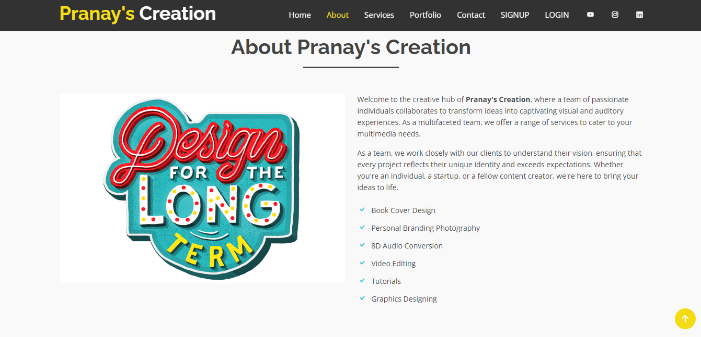
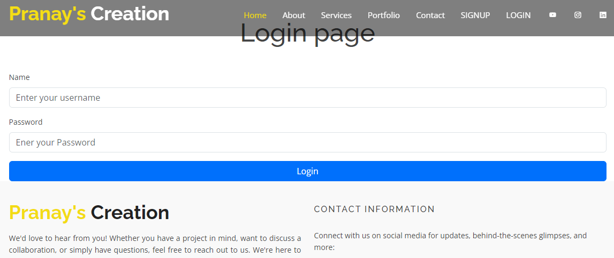
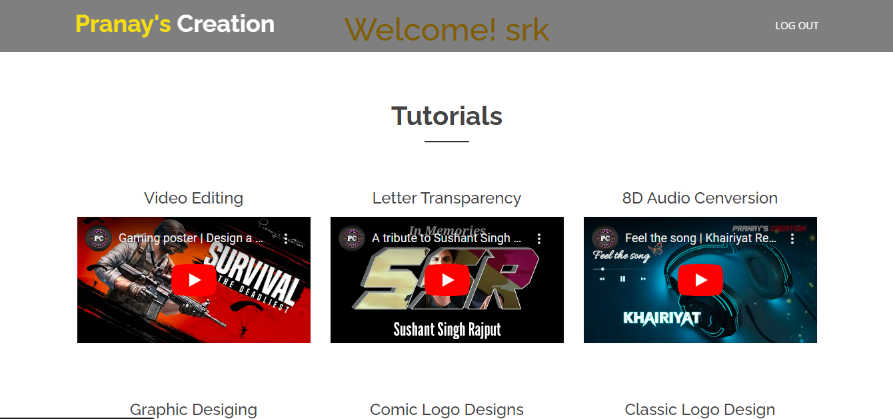

# Pranay's Creation

Educational website for video editing, technology used HTML5, CSS3, Bootstrap, PHP and MySQL

Home Page :

About :

Login Page :

After Login Home Page :

Note : Here the signup and login page will not work beacause it requires XAMPP server active 
and have to setup MySQL and Apache 

